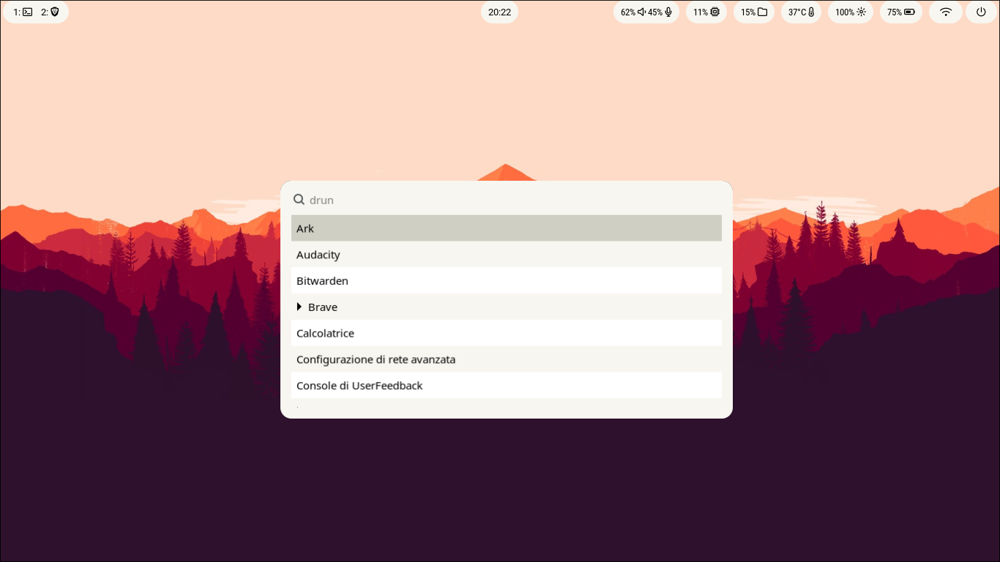
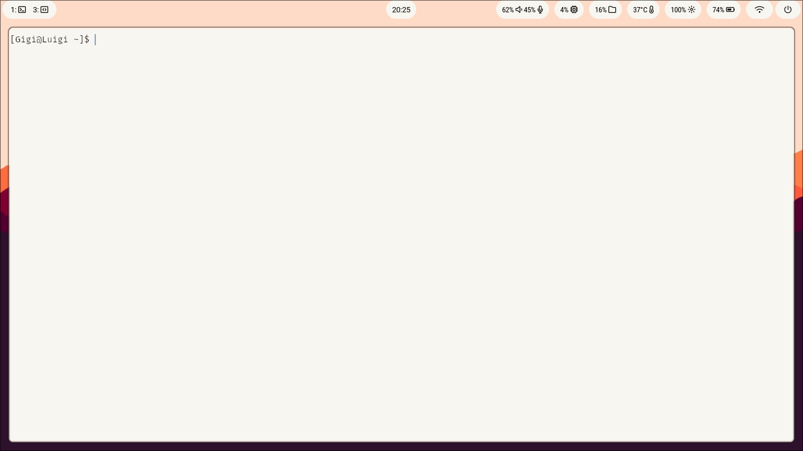

  
  

IMPORTANT: I'm not a programmer/developer, i'm only a passioned about Linux, so the code could not be clean or tidy. If you want, leave a comment on my rice

WM: Hyprland

External monitor Position: nwg-displays

Wallpaper: swaybg

File manager: dolphin (to solve the problem about“open with”, install archlinux-xdg-menu and type on the terminal 

‘XDG_MENU_PREFIX=arch- kbuildsycoca6’) (to extract files directly through dolphin, install through pacman ark)

Terminal: kitty (font: Fira Code)

Status Bar: waybar

Search Menu: wofi

Logout: wlogout

Text editor: nano
